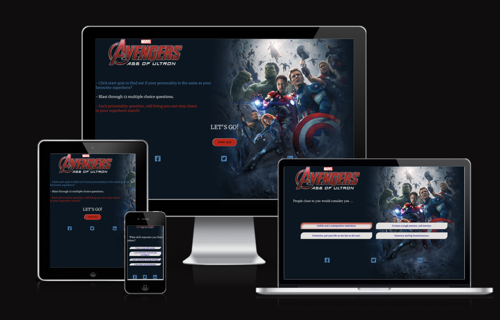
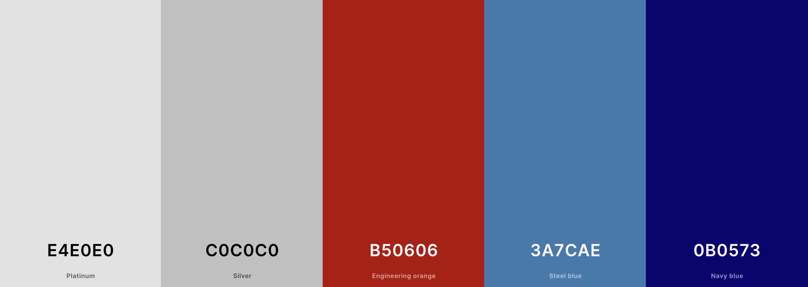
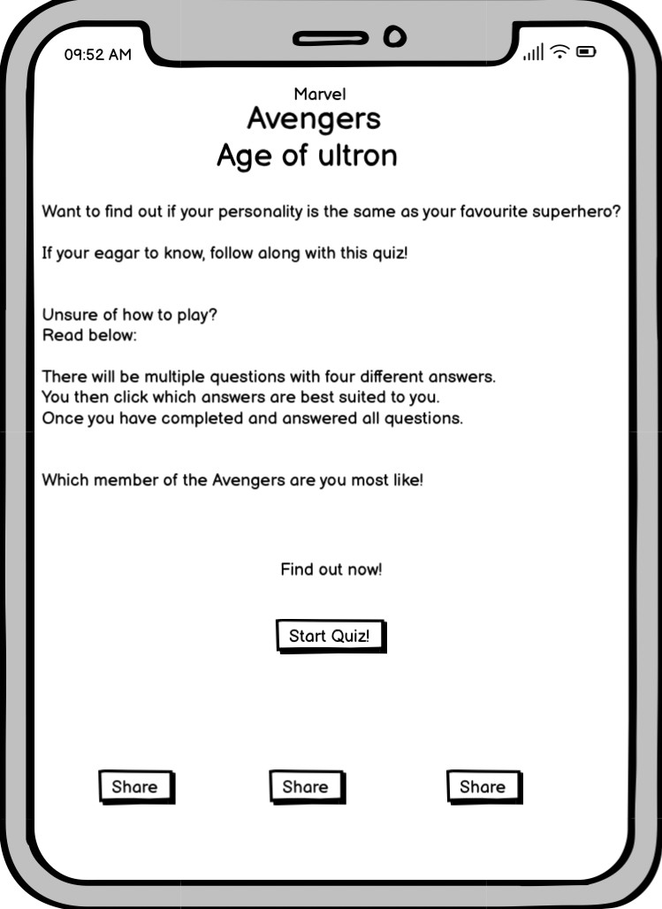
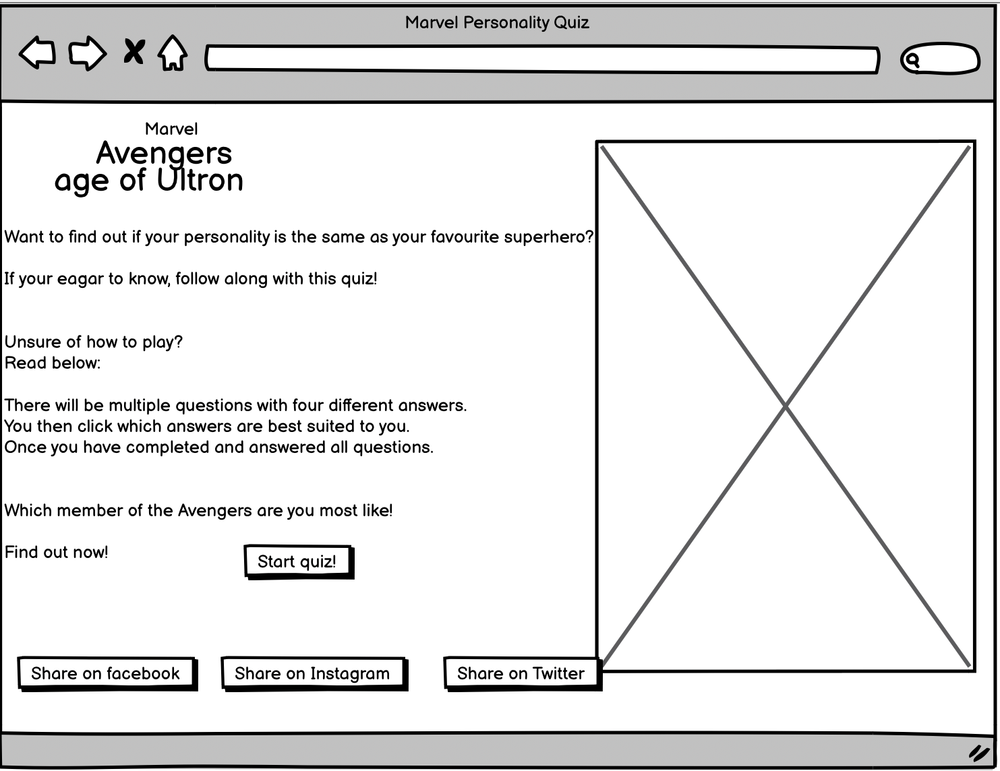
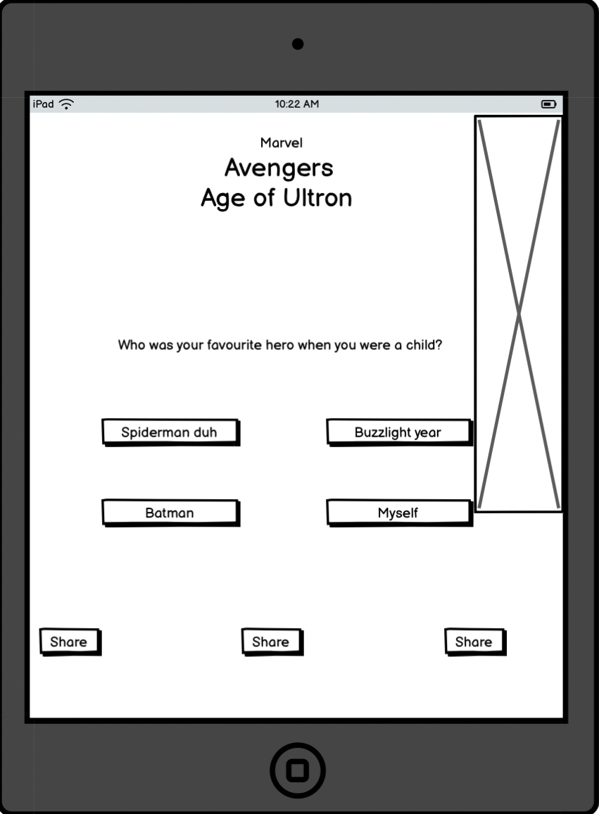
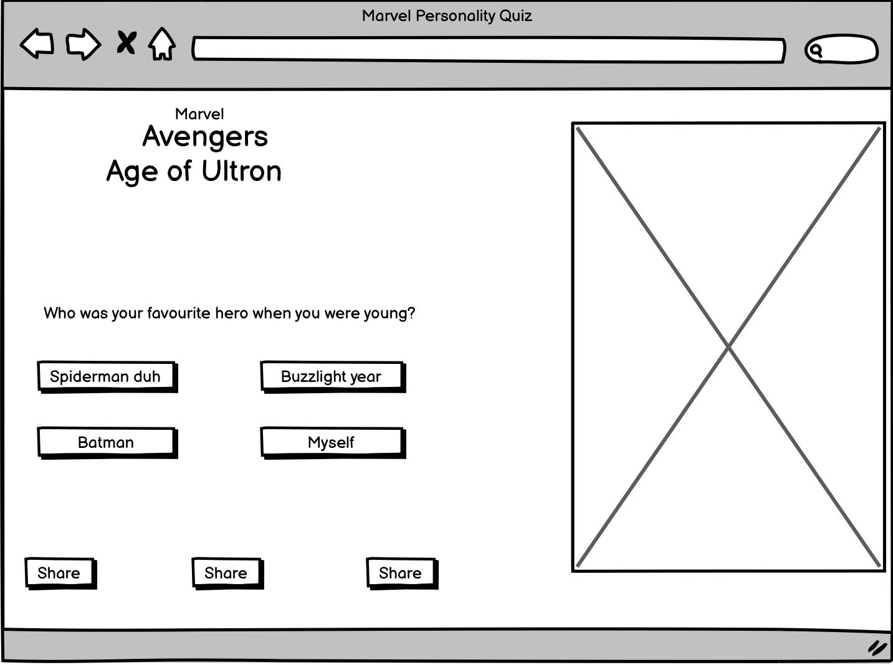
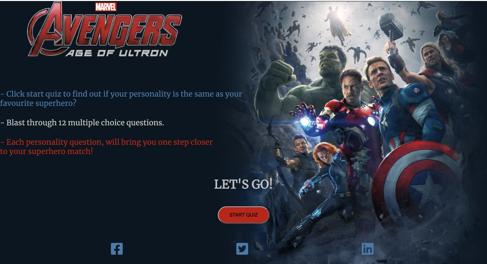
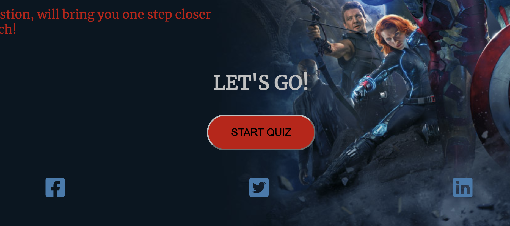
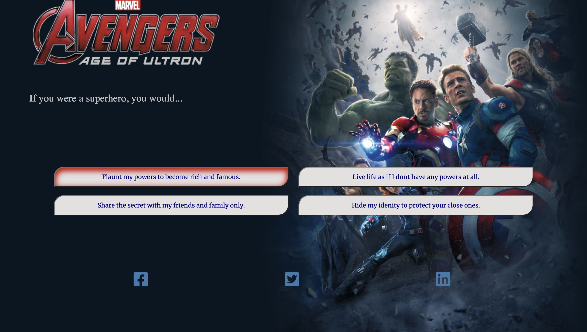

# MARVEL QUIZ

During my decision on what to do for project 2, I wanted to test myself while still being creative and having the user in mind. Doing a personality quiz was at the top of my list among other ideas, but having the user be interested in what the result will be and have them want to come back and see if they are a different superhero who they love or like, is what sold it for me. 

Marvel Quiz made sense to me because I feel everyone loves at least one or more of the Marvel franchise movies. At least I know I do and I have my fingers crossed you do too!

I hoped to accomplish a strong professional front to the webpage, while still having a friendly young aspect to it for the younger generation if they wanted to take the quiz. My goal was to have this website as modern as it could be so it doesn't need much maintenance as the years go by. 

I wanted to ensure the user that the correct result to match their own personality. To achieve this I had done research on each Avengers personality type, then to match it up with my answers I done the math of the total points and the results for them to match the user correctly. This was really important to me to have this working correctly , so the user had the full experience of a Marvel personality quiz.

Here's my deployed site as an example:
https://ui.dev/amiresponsive?url=https://shellym96.github.io/marvel-quiz

## UX

The colour of the Avenger heroes are typically red, blue, silver, green, purple and black. I decided to go with red, blue and silver with minor touches of navy to keep the cohesiveness among the background image and the text of the pages.

### Colour Scheme
The colours I chose to use are the original colours of the Avengers. Especially the background image I have used which has Captain America, his shield and iron man based in the front, (with the other heroes surrounding them) which are the colours - red, silver and blue. By using these colours I feel the page is cohesive and falls together quite naturally.

- `#C0C0C0` `#B50606` `#3A7CAE`used for primary text.
- `#E4E0E0` used for buttons background colour.
- `#0B0573` used for secondary text on buttons.
- `#B50606` used for highlight effect on the buttons with hover.
- `#3A7CAE` used for social media icons.

I used [coolors.co]https://coolors.co/e4e0e0-c0c0c0-b50606-3a7cae-0b0573 to generate my colour palette.

### Typography

For my font I wanted a strong slight masculine look although still be soft enough to be inviting for female users.

I had a look through google fonts and tried multiple different fonts I had  previously tried - Bangers, Oswald, Barlow and Playfair Display, before I settled on Merriweather. 

- [Merriweather](https://fonts.google.com/specimen/Merriweather?preview.text=avengers&preview.text_type=custom) was used for the primary headers and titles.

- [Font Awesome](https://fontawesome.com) icons were used throughout the site, such as the social media icons in the footer.

## Wireframes

I've used [Balsamiq](https://balsamiq.com/wireframes) to design my site wireframes. A few minor changes have been done while I was creating the site itself, majority remains the same.

### Home Page Wireframes

| Size | Screenshot |
| --- | --- |
| Mobile |  |
| Desktop |  |

### Questions and answers page Wireframes

| Size | Screenshot |
| --- | --- |
| Tablet |  |
| Desktop |  |

## Features

When I envisioned a user accessing the site, I wanted them to be pulled in straight away by a professional aspect along with them being intrigued to take the quiz. 

- When you first access the webpage it has a dark background image with the Avenger team in an action styled photo based to the right of the image. The image would be from the Avengers movie - Age of Ultron. This background then paired with a bold header image as the logo for the site. This to me added a professionalism to the page, rather than a text logo.

- To explain what the site does and what to do, I wanted to keep it short and sweet yet using buzz words to keep the user who is reading interested on going forward.

- The start button has a hover:zoom effect in place so when the user hovers their mouse over the button it will have a slight zoom, so they know their about to start the quiz. Once they access the questions page, it is accompanied by four different answers.

- I want the style of the questionnaire page simple with no distractions, so I kept the background image the same, and had a buttons easy to see and read with a simple yet effective design. I did add a click feature with an inset background-color of red when you hover over each button, to ensure the user this is the button they are about to click and have clicked. I wanted this to have a slight robotic/futuristic feel to it.

- For the results I want to user to receive the correct results to their own personality. That did enquire some work of math and working out which answers get what points in javascript, which in my opinion was worth the extra work to be sure the user experience was positive and they didn't feel they wasted their time. (so they'd feel inclined to recommend and return)
 

### Existing Features

- **Background-image and logo image**

    - Having a logo image rather than a text logo brings a more professional feel to the site, it blends into the background image really seamlessly therefore will be easy on the eye for any user.

- **Start Quiz button**

    - For the start quiz button, I wanted it to stand out against the background which is why I have it as a bright red with a silver border. I have the writing as black so it is clearly readable to the user. When you hover your mouse over the button it will zoom to make the button slightly bigger. The image below has the button zoomed.

- **Answer buttons**

    - I intended for the answer buttons to stand out with a brighter silver than the text used for the questions. Also adding in a hover effect so when your mouse is hovered over the button it has a red inset inside the button. (See image below) When the button is clicked it has a clicked effect.

### Future Features

I had many ideas for this project that I would have loved to do, but I honestly felt were beyond my abilities right in this moment. 

- Answer buttons
    - I would have liken to have my buttons more robotic and futuristic , perhaps not a noticeable button at all. When I done research into this, it would have had to be added as an image but the button hidden somewhere inside the image.
 - Question section
    - The same would go for my question section, I personally would have liken it to back a robotic background, slight transformer style but again it had to be added as an image and I was out of time for that.

## Tools & Technologies Used

- [HTML](https://en.wikipedia.org/wiki/HTML) used for the main site content.
- [CSS](https://en.wikipedia.org/wiki/CSS) used for the main site design and layout.
- [CSS Flexbox](https://www.w3schools.com/css/css3_flexbox.asp) used for an enhanced responsive layout.
- [CSS Grid](https://www.w3schools.com/css/css_grid.asp) used for an enhanced responsive layout.
- [JavaScript](https://www.javascript.com) used for user interaction on the site.
- [Git](https://git-scm.com) used for version control. (`git add`, `git commit`, `git push`)
- [GitHub](https://github.com) used for secure online code storage.
- [GitHub Pages](https://pages.github.com) used for hosting the deployed front-end site.
- [Gitpod](https://gitpod.io) used as a cloud-based IDE for development.
- [W3S schools](https://www.w3schools.com/) used for any struggles I had with my css or js.

## Testing

For all testing, please refer to the [TESTING.md](TESTING.md) file.

## Deployment

The site was deployed to GitHub Pages. The steps to deploy are as follows:
- In the [GitHub repository](https://github.com/shellym96/marvel-quiz), navigate to the Settings tab 
- From the source section drop-down menu, select the **Main** Branch, then click "Save".
- The page will be automatically refreshed with a detailed ribbon display to indicate the successful deployment.

The live link can be found [here](https://shellym96.github.io/marvel-quiz)

### Local Deployment

This project can be cloned or forked in order to make a local copy on your own system.

#### Cloning

You can clone the repository by following these steps:

1. Go to the [GitHub repository](https://github.com/shellym96/marvel-quiz) 
2. Locate the Code button above the list of files and click it 
3. Select if you prefer to clone using HTTPS, SSH, or GitHub CLI and click the copy button to copy the URL to your clipboard
4. Open Git Bash or Terminal
5. Change the current working directory to the one where you want the cloned directory
6. In your IDE Terminal, type the following command to clone my repository:
	- `git clone https://github.com/shellym96/marvel-quiz.git`
7. Press Enter to create your local clone.

Alternatively, if using Gitpod, you can click below to create your own workspace using this repository.

Please note that in order to directly open the project in Gitpod, you need to have the browser extension installed.
A tutorial on how to do that can be found [here](https://www.gitpod.io/docs/configure/user-settings/browser-extension).

#### Forking

By forking the GitHub Repository, we make a copy of the original repository on our GitHub account to view and/or make changes without affecting the original owner's repository.
You can fork this repository by using the following steps:

1. Log in to GitHub and locate the [GitHub Repository](https://github.com/shellym96/marvel-quiz)
2. At the top of the Repository (not top of page) just above the "Settings" Button on the menu, locate the "Fork" Button.
3. Once clicked, you should now have a copy of the original repository in your own GitHub account!

## Credits

### Content

| Source | Location | Notes |
| --- | --- | --- |
| [Markdown Builder](https://traveltimn.github.io/markdown-builder) | README and TESTING | tool to help generate the Markdown files |
| [W3Schools](https://www.w3schools.com/howto/howto_js_topnav_responsive.asp) | entire site | responsive HTML/CSS/JS navbar |
| [Flexbox Froggy](https://flexboxfroggy.com/) | entire site | modern responsive layouts |
| [YouTube](https://www.youtube.com/watch?v=riDzcEQbX6k) | Quiz | to help with some issues on the quiz |

### Media
For my media which would be my background image, my logo image and my icons are stated below with links to websites.

| Source | Location | Type | Notes |
| --- | --- | --- | --- |
| [Marvel.com](https://www.marvel.com/whichavengerareyou/en_US/) | entire site | image | background image |
| [Marvel.com](https://www.marvel.com/whichavengerareyou/en_US/) | entire site | logo | logo image |
| [Font Awesome](https://fontawesome.com/) | entire site | icon | facebook, instagram and linkdin icons |

### Acknowledgements

I couldn't be more thankful for the help and support I have received throughout this project as I found it hard to get started on project two even though I knew what I had wanted to do. 
With that being said , again I am hugely grateful and thankful to my mentor and a girl in my course, who is now a friend. 

- I would like to thank my Code Institute mentor for being a constant support system and helping me feel confident the entire way, reminding me I am getting to where I need to be. So thank you again to [Tim Nelson](https://github.com/TravelTimN) for their support throughout the development of this project.
- I would like to thank the [Code Institute](https://codeinstitute.net) tutor team for their assistance with troubleshooting and debugging some project issues.
- I would like to thank the [Code Institute Slack community](https://code-institute-room.slack.com) for the moral support; it kept me going during periods of self doubt and imposter syndrome.
- I would like to thank my partner (John/Jane), for believing in me, and allowing me to make this transition into software development.
- I would like to thank my employer, for supporting me in my career development change towards becoming a software developer.
