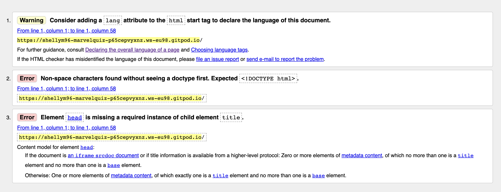
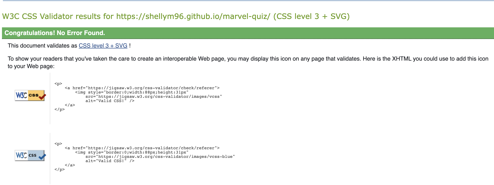
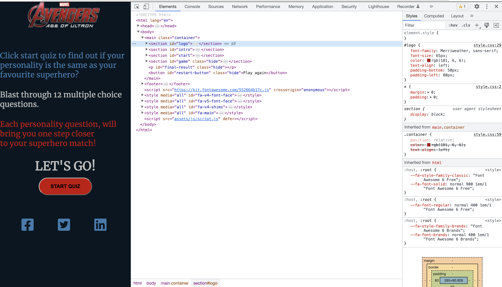
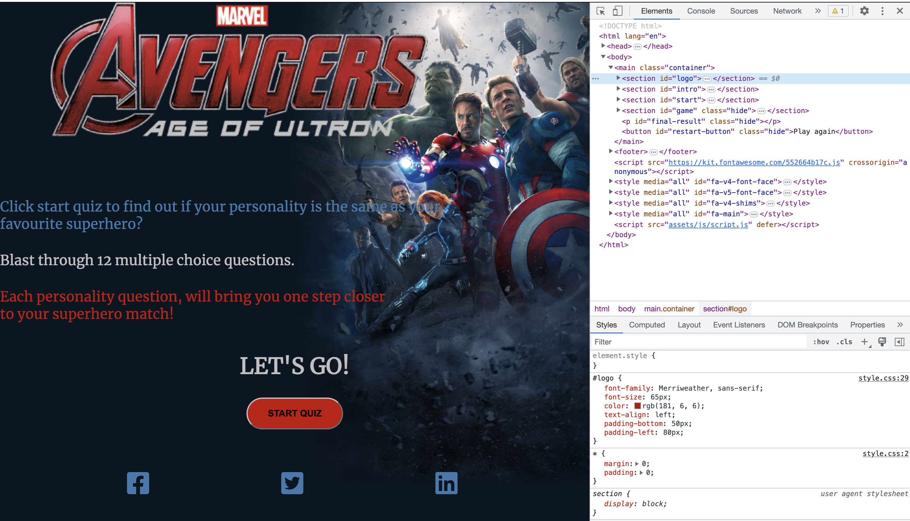
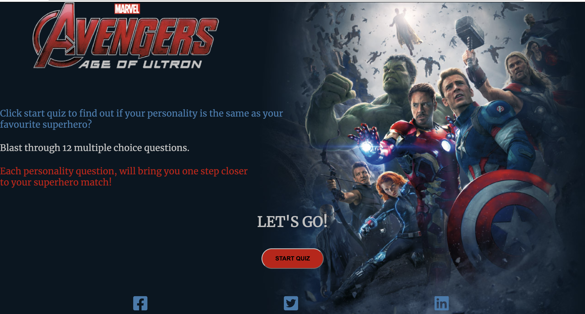
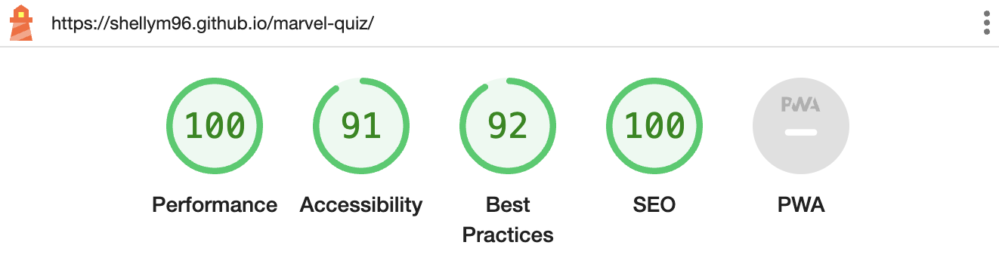
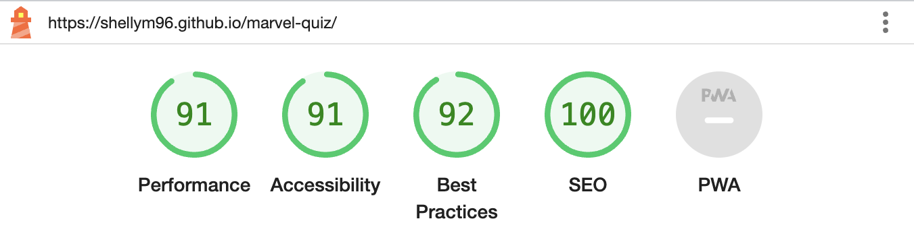
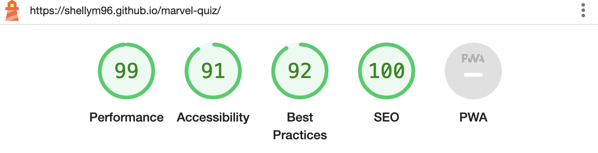
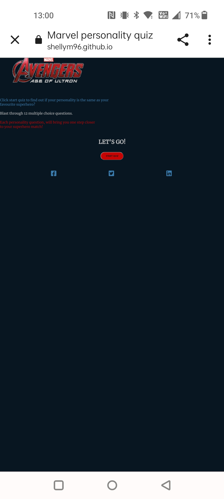
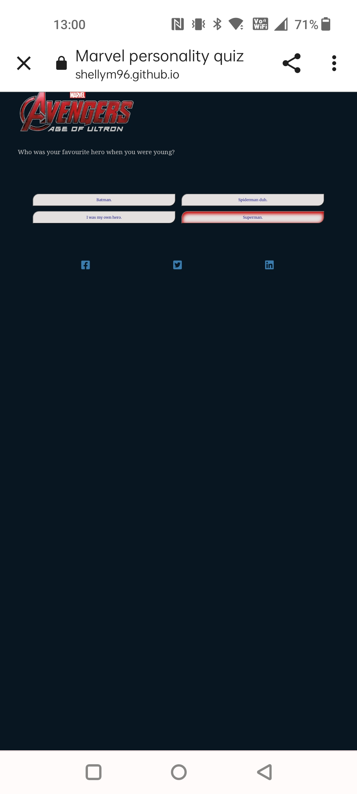

# Testing

Return back to the [README.md](README.md) file.

## Code Validation

### HTML

I have used the recommended [HTML W3C Validator](https://validator.w3.org) to validate my HTML files.
See link below:

- https://validator.w3.org/nu/?doc=https%3A%2F%2Fshellym96.github.io%2Fmarvel-quiz%2Findex.html

| Page | W3C URL | Screenshot | Notes |
| --- | --- | --- | --- |
| Home | [W3C](https://validator.w3.org/nu/?doc=https%3A%2F%2Fshellym96.github.io%2Fmarvel-quiz%2Findex.html) |  | Section lacks header |

### CSS

I have used the recommended [CSS Jigsaw Validator](https://jigsaw.w3.org/css-validator) to validate all of my CSS files.
See link below:
- https://jigsaw.w3.org/css-validator/validator?uri=https%3A%2F%2Fshellym96.github.io%2Fmarvel-quiz

**IMPORTANT**: Third-Party tools

If you're using extras like Bootstrap, Materialize, Font Awesome, then sometimes the validator
will attempt to also validate this code, even if it's not part of your own actual code.
You are not required to validate the external libraries or frameworks!

Sample CSS code validation documentation (tables are extremely helpful!):

🛑🛑🛑🛑🛑 END OF NOTES (to be deleted) 🛑🛑🛑🛑🛑

| File | Jigsaw URL | Screenshot | Notes |
| --- | --- | --- | --- |
| style.css | [Jigsaw](https://jigsaw.w3.org/css-validator/validator?uri=https%3A%2F%2Fshellym96.github.io%2Fmarvel-quiz) |  | Pass: No Errors |

## Responsiveness

The minimum requirement is for the following 3 tests:
- Mobile
- Tablet
- Desktop

**IMPORTANT**: You must provide screenshots of the tested responsiveness, to "prove" that you've actually tested them.

Using the "amiresponsive" mockup image (or similar) does not suffice the requirements.
Consider using some of the built-in device sizes in the Developer Tools.

If you have tested the project on your actual mobile phone or tablet, consider also including screenshots of these as well.
It showcases a higher level of manual tests, and can be seen as a positive inclusion!

Sample responsiveness testing documentation:

🛑🛑🛑🛑🛑 END OF NOTES (to be deleted) 🛑🛑🛑🛑🛑

I've tested my deployed project on multiple devices to check for responsiveness issues.

| Device | Screenshot | Notes |
| --- | --- | --- |
| Mobile (DevTools) |  | Works as expected |
| Tablet (DevTools) |  | Works as expected |
| Desktop |  | Works as expected |

## Lighthouse Audit

I've tested my deployed project using the Lighthouse Audit tool to check for any major issues. Everything came back very well which I'm happy about.

| Page | Size | Screenshot | Notes |
| --- | --- | --- | --- |
| Home | Desktop |  | All high greens |
| Questions/Answers | Desktop |  | All high greens |
| Home | Mobile |  | All high greens |
| Questions/answers | Mobile |  | All high greens |

## Bugs

- My first bug I came across was when I started to do script.js. I had done my start-button in html and css, but when I tried to put the button to use to start the quiz and it would not work , although I had started the javascript. I had exhausted options I knew of, and checked google until I had to contact student support and they helped me figure out the bug that was in the css. There was a display flex taking priority so I added display:none !important , to my button and that done the job. | Corrected |

- Secondly my questions wouldn't appear , after examining my code closely until I realised I had my function for the questions spelled incorrectly. Once this was corrected the questions appeared. | Corrected |

## Unfixed Bugs

Bugs that have not been fixed would be in responsiveness.

- On a physical mobile phone rather than DevTools, the entire screen shrunk up to the very top.

    
    
 

- On a physical mobile phone, when user clicked a button the hover inset colour effect would remain in position for next question. See example below : before that question I had clicked the bottom left button and then the highlight remained there, I am assuming this is because the mobile device does not show the mouse, and technically the mouse is hovering over the button itself.

    

Other than the bugs I have mentioned, there are no remaining bugs that I am aware of.
